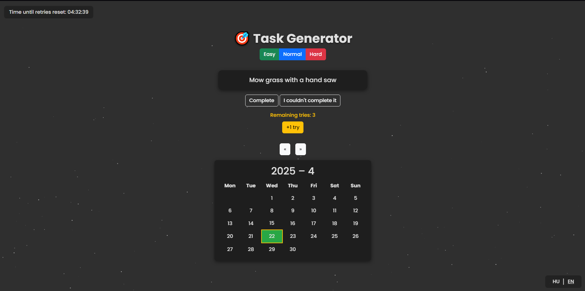

# Task Generator 🎯

**A simple, responsive web app with F# frontend**

This project is an interactive task generator offering three daily challenges—**Easy**, **Normal**, and **Hard**—to users. Users can mark a task as completed or failed, and view their performance history on a monthly calendar. The daily attempt count resets every day at 23:59:59.

---

## Key Features

- **Three difficulty levels**: Easy, Normal, and Hard tasks
- **Calendar view**: Green and red highlights for successful and unsuccessful days
- **Daily reset**: Attempt count resets at 23:59:59 each day
- **Starfield background** and **animated UI** for a modern look
- **Multilingual support**: English and Hungarian interfaces
- **Responsive design** powered by Bootstrap 5

---

## Installation & Running

1. Clone the repository:
   ```bash
   git clone https://github.com/Lilluska01/task-generator.git
   cd task-generator
   ```
2. Open `index.html` in your browser, or serve it with a simple HTTP server:
   ```bash
   npm install -g http-server
   http-server .
   ```
3. Navigate to `http://localhost:5000` to use the app.


OR

Open on this link: https://taskgenerator-eubcd6hud6dghgek.germanywestcentral-01.azurewebsites.net/index.html


---

## Usage

- **Register**/**Login**
- **Generate a new task**: Click **Easy**, **Normal**, or **Hard**
- **Mark complete**: Click **Complete** to turn the task box green
- **Mark fail**: Click **I couldn't complete it** to turn it red and prompt further attempts
- **Browse calendar**: Use the **Previous** and **Next** buttons to switch months
- **Switch language**: Click **EN** or **HU** at the bottom right

---

## Example Screenshot



---
